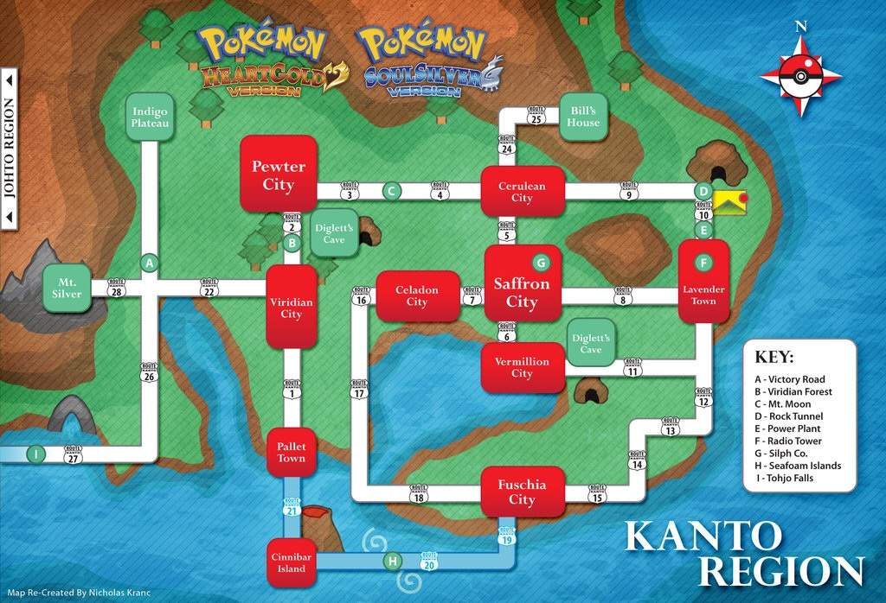

## Python Pokemon  - Kanto Region

### Description
A Python Text Based Pokemon Game - Kanto Region

### Lessons Learned
I was practicing seperation of concerns in terms of seperating the game data from the game logic. Being able to increase the playable functionality by updating data instead of logic is more scalable.
